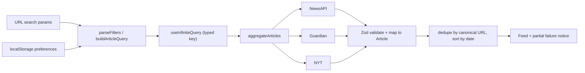

# News Hub — news aggregator

A news aggregator that pulls articles from **NewsAPI**, **The Guardian** and **The New York Times**,
normalizes them into a single feed, and adds search, filtering and a personalized feed.

Built with React 19, TypeScript 7 (strict), Vite 8, TanStack Query, Material UI and CSS modules.

## Quick start

```bash
pnpm install
cp .env.example .env   # add the keys you have; the rest are skipped
pnpm dev               # http://localhost:9000
```

Any provider without a key is skipped automatically. The app explains which keys are missing and
links to where each one is created, so it stays usable with one, two or three providers.

## API keys

| Variable                | Provider       | Where to get it                                                                                          |
| ----------------------- | -------------- | -------------------------------------------------------------------------------------------------------- |
| `VITE_NEWS_API_KEY`     | NewsAPI.org    | [newsapi.org/register](https://newsapi.org/register)                                                     |
| `VITE_GUARDIAN_API_KEY` | The Guardian   | [open-platform.theguardian.com/access](https://open-platform.theguardian.com/access/)                    |
| `VITE_NYT_API_KEY`      | New York Times | [developer.nytimes.com/get-started](https://developer.nytimes.com/get-started) (enable "Article Search") |

Notes:

- **NewsAPI CORS.** NewsAPI rejects browser requests from other origins, so the app always
  calls it through `/proxy/newsapi`. The Vite dev/preview server and nginx both forward that path.
  Guardian and NYT are called from the browser.
- **NYT allows 5 requests/minute.** A `429` is converted into a typed `rate_limit` error, retried
  with backoff, and reported as a partial failure rather than breaking the feed.

## Scripts

| Command          | Description                        |
| ---------------- | ---------------------------------- |
| `pnpm dev`       | Dev server on port 9000            |
| `pnpm build`     | Typecheck (`tsc -b`) and build     |
| `pnpm preview`   | Serve the production build on 9100 |
| `pnpm typecheck` | Types only                         |
| `pnpm lint`      | oxlint                             |
| `pnpm test`      | Unit tests (Vitest)                |

## Docker

```bash
docker compose up --build          # http://localhost:8080
```

Vite inlines `VITE_*` keys at **build** time. Compose reads them from your shell or from a `.env`
file beside `docker-compose.yml`.

```bash
docker build \
  --build-arg VITE_GUARDIAN_API_KEY=... \
  --build-arg VITE_NYT_API_KEY=... \
  --build-arg VITE_NEWS_API_KEY=... \
  -t news-hub .

docker run --rm -p 8080:80 news-hub
```

The image is multi-stage: Node builds the static bundle, nginx serves it with SPA fallback,
immutable asset caching and the NewsAPI proxy.

## Architecture

```
src/
  app/                     Providers, router, shell, header
  components/              Material UI wrappers (one folder per component)
  hooks/                   useDebouncedValue
  lib/                     env, http boundary (requestJson + ApiError), cx
  features/
    articles/
      api/providers/       One adapter per provider: schema, request builder, mapper
      api/aggregate.ts     Concurrent fetch, dedupe, sort, partial failures
      components/          Feed, card, states
      helpers/             Text, matching, dedupe, dates
      hooks/               useArticleFeed
      queries.ts           infiniteQueryOptions for the feed
      types.ts             Domain types (Article, ArticleQuery, ...)
    filters/               URL search-param boundary + filter UI
    preferences/           Versioned localStorage, matching, preferences UI
  pages/                   AllNewsPage, ForYouPage, PreferencesPage
```

### Data flow



Every response is validated with Zod at the boundary before a mapper touches it, so provider payloads
are treated as untrusted and no provider-specific field reaches a component. Raw response types live
next to their adapter and never leak into the domain `Article` type.

### Provider capabilities

Filters are translated into API parameters where the provider supports them, and applied after
normalization where it does not.

| Filter     | NewsAPI                                       | The Guardian            | New York Times            |
| ---------- | --------------------------------------------- | ----------------------- | ------------------------- |
| Keyword    | `q`                                           | `q`                     | `q`                       |
| Date range | `from` / `to` (end of day)                    | `from-date` / `to-date` | `begin_date` / `end_date` |
| Category   | not supported — used as keywords (documented) | `section` (OR-joined)   | `fq=section_name:("A" OR "B")` |
| Source     | query selects that adapter only               | same                    | same                      |
| Author     | after normalization, case-insensitive         | same                    | same                      |
| Page size  | 20                                            | 20                      | 10 (fixed by the API)     |

`/v2/everything` has no category facet, so selected categories are added to the keyword query.
Articles from NewsAPI carry no category; that absence is skipped in preference matching so an
author filter still applies. Category aliases are matched as whole tokens (`us` does not match
`business`).

### Aggregation and partial failures

`aggregateArticles` fetches the selected providers concurrently with `Promise.allSettled`:

- Successful providers are always displayed, even if others fail.
- Failures are returned next to the data as typed `ProviderFailure[]` and rendered as a
  non-blocking warning.
- The query fails only when **every** provider fails.
- Duplicates are removed by canonicalized URL (lowercased host, no `www.`, no trailing slash, no
  tracking parameters), falling back to the provider id and then to normalized title plus
  publication minute.
- Results are sorted by `publishedAt` descending; API responses are never mutated.

### State ownership

Each piece of state has exactly one home:

- **URL search params** — committed search term and all filters, so views are refreshable,
  bookmarkable and shareable. `features/filters/searchParams.ts` is the only place raw strings are
  parsed or serialized.
- **TanStack Query cache** — article data, loading and error state. Changing committed filters
  changes the query key, which resets pagination naturally.
- **Local component state** — only the uncommitted search keystrokes (debounced 400 ms) and small
  form drafts.
- **localStorage** — preferences, under the versioned key `news-aggregator:preferences:v1`,
  validated on read with a graceful fallback to defaults.

The feed distinguishes initial loading (skeletons), background refetching (inline indicator),
loading another page (inline row), complete failure (full error state with retry), partial provider
failure (warning) and empty results (reset-filters action). The next page is requested when the
end of the list is near, as long as `hasNextPage && !isFetchingNextPage && !isRefreshing` and no
page has failed.

## Accessibility

Semantic list markup for the feed, labelled search and filter controls, `aria-invalid` plus an inline
message on an impossible date range, `aria-live` regions for loading and refreshing, visible focus
rings, `<time dateTime>` for publication dates, and an accessible mobile filter drawer.

## Testing

Unit tests cover the risky, pure parts: the three provider request builders and mappers
(including both NYT `multimedia` shapes), URL canonicalization and deduplication, filter
parse/serialize round-trips and query building, preference matching semantics, and recovery from
invalid or outdated stored JSON.

```bash
pnpm test
```
