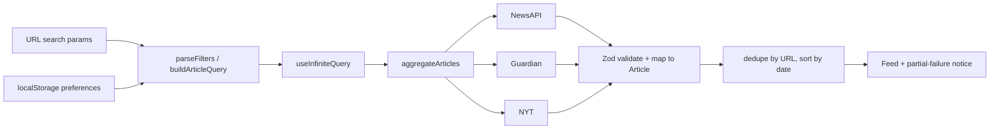

# News Hub

A news aggregator that pulls articles from **NewsAPI**, **The Guardian** and **The New York Times**, normalizes them into one feed, and adds search, filtering and a personalized feed.

Built with React 19, TypeScript (strict), Vite, TanStack Query, Material UI and CSS modules.

---

## What this covers

The take-home asks for a React + TypeScript frontend, at least three news APIs, Docker, and a mobile-responsive UI. This project maps to that as follows:

| Requirement                         | Where it lives                                                                                     |
| ----------------------------------- | -------------------------------------------------------------------------------------------------- |
| Search by keyword                   | Search field on All news / For you; stored in the URL                                              |
| Filter by date, category and source | Filter panel (desktop) and filter sheet (mobile)                                                   |
| Personalized feed                   | **For you** (`/for-you`) plus **Preferences** (`/preferences`) for sources, categories and authors |
| Mobile-responsive layout            | Filter sheet on small screens, stacked header, readable cards                                      |
| Three data sources                  | NewsAPI.org, The Guardian, The New York Times                                                      |
| Docker                              | `Dockerfile` + `docker-compose.yml` + `nginx.conf` — see [Run with Docker](#run-with-docker)       |

A provider without a key is skipped. The UI lists missing keys and links to where each one is created, so the app still runs with one, two or three providers.

---

## What you need

**To run locally**

- [Node.js](https://nodejs.org/) 22 or newer
- [pnpm](https://pnpm.io/) 11 (this repo pins `pnpm@11.21.0`; `corepack enable` is enough)
- At least one API key from the table below (three keys for the full feed)

**To run in Docker** (the expected review path)

- [Docker Desktop](https://www.docker.com/products/docker-desktop/) (or Docker Engine + Compose)
- The same API keys in a `.env` file next to `docker-compose.yml`

---

## API keys

Copy the example file and fill in the keys you have:

```bash
cp .env.example .env
```

| Variable                | Provider       | Where to get it                                                                                            |
| ----------------------- | -------------- | ---------------------------------------------------------------------------------------------------------- |
| `VITE_NEWS_API_KEY`     | NewsAPI.org    | [newsapi.org/register](https://newsapi.org/register)                                                       |
| `VITE_GUARDIAN_API_KEY` | The Guardian   | [open-platform.theguardian.com/access](https://open-platform.theguardian.com/access/)                      |
| `VITE_NYT_API_KEY`      | New York Times | [developer.nytimes.com/get-started](https://developer.nytimes.com/get-started) — enable **Article Search** |

Notes that affect what you see:

- **NewsAPI CORS.** Browser calls to NewsAPI from another origin are blocked, so the app always uses `/proxy/newsapi`. Vite (dev/preview) and nginx (Docker) both forward that path. Guardian and NYT are called from the browser.
- **NYT free tier is 5 requests/minute.** A `429` becomes a typed `rate_limit` error, is retried with backoff, and shows as a partial failure instead of emptying the feed.
- **NewsAPI developer plan stops at 100 results.** A `426` becomes a typed `result_limit` warning and is not retried. Other providers keep loading.
- **Vite inlines `VITE_*` at build time.** Changing a key means restarting `pnpm dev`, or **rebuilding** the Docker image (`docker compose up --build`). Restarting the container alone is not enough.

---

## Run locally

```bash
pnpm install
cp .env.example .env   # then add the keys you have
pnpm dev               # http://localhost:9000
```

| Command          | What it does                              |
| ---------------- | ----------------------------------------- |
| `pnpm dev`       | Dev server on port 9000                   |
| `pnpm build`     | Typecheck (`tsc -b`) and production build |
| `pnpm preview`   | Serve the production build on 9100        |
| `pnpm typecheck` | Types only                                |
| `pnpm lint`      | oxlint                                    |
| `pnpm test`      | Unit tests (Vitest)                       |

---

## Run with Docker

This is the containerized production build: Node compiles the SPA, then **nginx** serves the static files, handles React Router URLs, and proxies NewsAPI.

1. Put keys in `.env` next to `docker-compose.yml` (same names as `.env.example`).
2. Build and start:

```bash
docker compose up --build
```

3. Open **http://localhost:8080**.
4. Stop with `Ctrl+C`, or `docker compose down` in another terminal.

Compose reads `VITE_*` from your shell or from that `.env` file and passes them as **build arguments**. After you change a key, run `docker compose up --build` again.

Without Compose:

```bash
docker build \
  --build-arg VITE_NEWS_API_KEY=... \
  --build-arg VITE_GUARDIAN_API_KEY=... \
  --build-arg VITE_NYT_API_KEY=... \
  -t news-hub .

docker run --rm -p 8080:80 news-hub
```

---

## File and folder structure

Feature-sliced layout: shared UI under `components/`, product logic under `features/`, routes under `pages/`. Each component lives in its own folder (`index.tsx` + CSS module).

```
.
├── Dockerfile                 # Multi-stage build: Node → nginx
├── docker-compose.yml         # Maps localhost:8080 → container :80; injects VITE_* keys
├── nginx.conf                 # Static SPA, asset cache, NewsAPI proxy
├── .env.example               # Key names and where to create them
├── vite.config.ts             # Dev server, NewsAPI proxy, tests
├── index.html
├── public/
└── src/
    ├── main.tsx               # App bootstrap
    ├── index.css              # Global styles
    ├── vite-env.d.ts          # VITE_* typings
    │
    ├── app/                   # Shell that wraps every page
    │   ├── App/               # Router and providers
    │   ├── RootLayout/        # Header + <Outlet />
    │   ├── Header/            # Nav: All news, For you, Preferences
    │   ├── QueryProvider/     # TanStack Query client
    │   └── ThemeProvider/     # MUI theme
    │
    ├── pages/                 # One folder per route (thin: wire filters + feed)
    │   ├── AllNewsPage/       # /          — full aggregated feed
    │   ├── ForYouPage/        # /for-you   — feed filtered by preferences
    │   └── PreferencesPage/   # /preferences
    │
    ├── features/
    │   ├── articles/          # Fetch, normalize, render the feed
    │   │   ├── types.ts       # Article, ArticleQuery, ProviderId, …
    │   │   ├── queries.ts     # infiniteQueryOptions for the feed
    │   │   ├── api/
    │   │   │   ├── aggregate.ts          # Parallel fetch, dedupe, sort, partial failures
    │   │   │   └── providers/
    │   │   │       ├── adapter/          # Shared ProviderAdapter contract
    │   │   │       ├── newsapi/          # Schema, URL builder, mapper
    │   │   │       ├── guardian/
    │   │   │       ├── nyt/
    │   │   │       └── index.ts          # Which providers have keys
    │   │   ├── helpers/       # Dedupe, matching, dates, text
    │   │   ├── hooks/         # useArticleFeed
    │   │   └── components/    # Feed, card, notices, placeholders
    │   │
    │   ├── filters/           # Search + date/category/source filters
    │   │   ├── searchParams.ts           # Only place URL strings are parsed/serialized
    │   │   ├── useArticleFilters.ts
    │   │   └── components/    # SearchInput, FilterPanel, MobileFilterSheet
    │   │
    │   └── preferences/       # Personalized feed (localStorage)
    │       ├── storage.ts     # Versioned key + Zod parse
    │       ├── applyPreferences.ts
    │       ├── PreferencesContext/
    │       └── components/    # PreferencesPanel, TokenListEditor
    │
    ├── components/            # Shared primitives (button, sheet, select, …)
    ├── hooks/                 # useDebouncedValue
    └── lib/                   # env, HTTP + ApiError, classnames
```

**Root Docker files**

| File                 | Role                                                                                                           |
| -------------------- | -------------------------------------------------------------------------------------------------------------- |
| `Dockerfile`         | Stage 1: `pnpm build`. Stage 2: copy `dist/` into nginx.                                                       |
| `docker-compose.yml` | Builds the image, publishes port 8080, passes API keys as build args.                                          |
| `nginx.conf`         | Serves `index.html` for client routes, long-cache for hashed `/assets/`, proxies `/proxy/newsapi/` to NewsAPI. |
| `.dockerignore`      | Keeps `node_modules`, `.git` and `.env` out of the build context.                                              |

**How to find something**

- Change a route or the header → `src/app/` or `src/pages/`
- Change how an API is called or mapped → `src/features/articles/api/providers/<name>/`
- Change search or URL filters → `src/features/filters/`
- Change “For you” matching or stored prefs → `src/features/preferences/`
- Change a shared control (button, sheet) → `src/components/`

---

## How it works



Every provider response is validated with Zod before a mapper runs. Raw payload types stay next to the adapter and never leak into the domain `Article` type.

### Provider capabilities

Filters become API parameters where the provider supports them, and are applied after normalization where it does not.

| Filter     | NewsAPI                               | The Guardian            | New York Times                 |
| ---------- | ------------------------------------- | ----------------------- | ------------------------------ |
| Keyword    | `q`                                   | `q`                     | `q`                            |
| Date range | `from` / `to` (end of day)            | `from-date` / `to-date` | `begin_date` / `end_date`      |
| Category   | no section field — see below          | `section` (OR-joined)   | `fq=section_name:("A" OR "B")` |
| Source     | query selects that adapter only       | same                    | same                           |
| Author     | after normalization, case-insensitive | same                    | same                           |
| Page size  | 20                                    | 20                      | 10 (fixed by the API)          |

**NewsAPI has no category field.** Guardian and NYT return a section (`technology`, `U.S.`, `Business Day`). NewsAPI’s `/v2/everything` does not, so the app handles that in three places:

1. **Search.** A chosen category is appended to the keyword query (`ai` + Technology → `q=ai (technology)`). That is a text search, not a real section filter.
2. **Stored articles.** NewsAPI items are saved with `category: null`. On **For you**, a missing category is ignored instead of treated as a mismatch, so an author preference can still keep those articles.
3. **Guardian / NYT labels.** Provider section names are mapped onto the app’s categories via aliases (`politics` includes `us` and `u.s.`). Matching is by whole word, so `us` matches `U.S.` but not `business`.

### Aggregation and partial failures

`aggregateArticles` fetches the selected providers concurrently with `Promise.allSettled`:

- Successful providers are always shown, even if others fail.
- Failures are typed `ProviderFailure[]` and render as a non-blocking warning.
- The query fails only when **every** provider fails.
- Duplicates are removed by canonical URL (lowercased host, no `www.`, no trailing slash, no tracking params), then provider id, then normalized title plus publication minute.
- Results are sorted by `publishedAt` descending. API responses are never mutated.

### State ownership

Each piece of state has one home:

- **URL search params** — committed search and filters, so views are refreshable and shareable. `features/filters/searchParams.ts` is the only place raw strings are parsed or serialized.
- **TanStack Query cache** — article data, loading and error. Changing filters changes the query key and resets pagination.
- **Local component state** — uncommitted search keystrokes (debounced 400 ms) and small form drafts.
- **localStorage** — preferences under `news-aggregator:preferences:v1`, validated on read with a fallback to defaults.

The feed distinguishes initial loading (skeletons), background refetch, next-page loading, full failure (retry), partial provider failure (warning) and empty results (reset filters). The next page loads when the list end is near, if `hasNextPage && !isFetchingNextPage && !isRefreshing` and no page has failed.

---

## Testing

Unit tests

```bash
pnpm test
```

---
